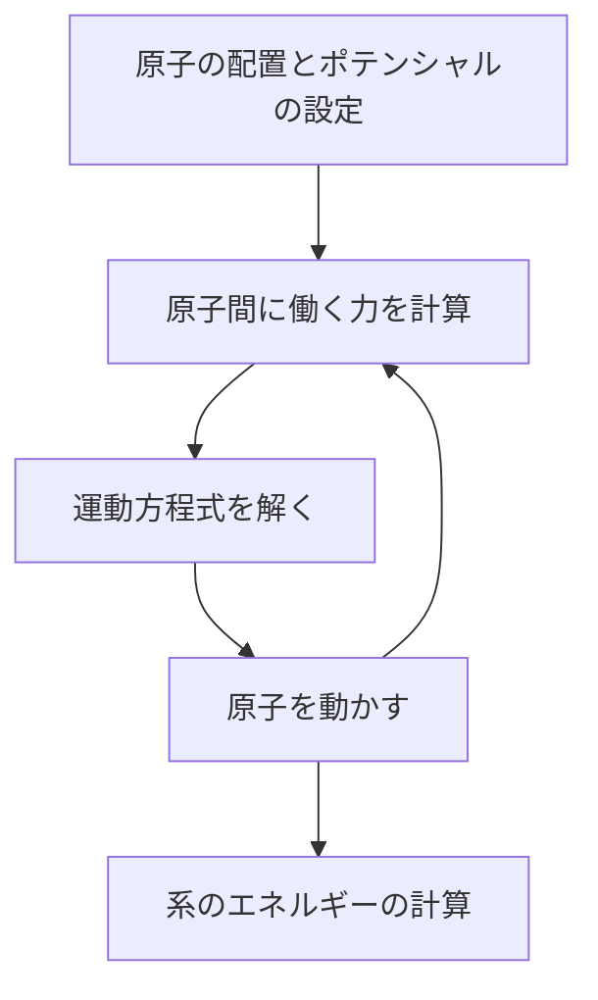
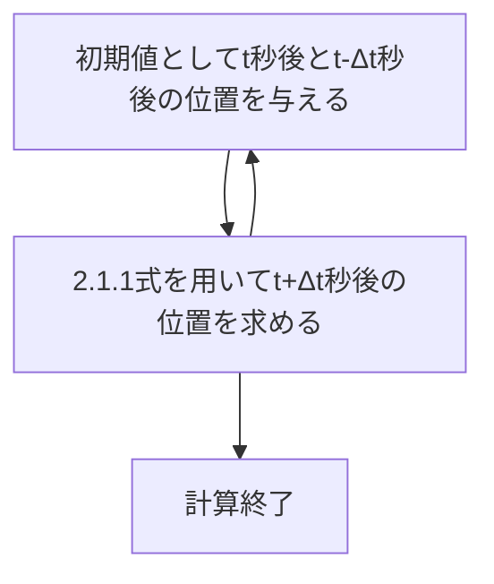
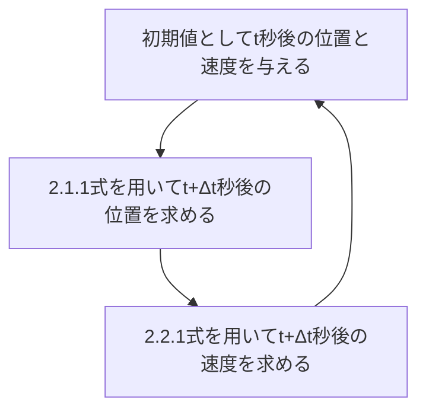

# Molecular Dynamics 理論
&emsp;本ドキュメントでは、LAMMPSやVASPを用いるにあたり、必要となるであろうMDの理論を説明する。

## 目次
1. [概要](#1-概要)
2. [運動方程式](#2-運動方程式)
3. ポテンシャル
4. 系と周期的境界条件
5. 構造最適化
6. 温度制御
7. 圧力制御

## 1. 概要
&emsp;MDとは、Molecular Dynamicsの頭文字をとっており、__分子動力学法__ と訳される。古典力学を用いたシミュレーション方法であり、主に原子間に働く力をポテンシャルから算出し、原子を動かしながら物性を予測するシミュレーションである。昨今では、今まで使われていた経験的ポテンシャルに代わり、機械学習ポテンシャルを用いた計算が主流となってきている。本ドキュメントでは、機械学習ポテンシャルには触れず、MDシミュレーションがどのような流れで行われているかについて述べる。  
　まずは、力学内でのMDの位置づけを見ていく。下の図を見てほしい。  

 

   
この図は有名だが、量子力学や古典力学、連続体力学のシミュレーションの種類と、時間スケール、扱える原子数を示している。MDであれば、1ps~1nsスケールのシミュレーションを扱えるという意味である。 縦軸は計算コストではないので注意が必要である。  
　また、研究の観点からの位置づけも見ていく。  

  
このように、実験を行う前に理論に基づいた計算を行うことで、実験コストを最小限に抑えたり、危険性や毒性がある物質の取り扱いが容易となるのである。  
　さて、本編に入る前に、MDシミュレーションの大まかな流れを最後に述べる。  

このフローチャートの中身についてこれから説明していくこととする。

## 2. 運動方程式
&emsp;順番は前後するが、まずは運動方程式について説明する。運動方程式がなぜ
必要なのかというと、MDでは原子の座標の情報が必要不可欠だからである。原子にかかる力がわかれば、加速度がわかり、速度や $\Delta t$ 秒後の位置も求まるというのは想像に容易いだろう。  

　さて、ポテンシャルから力を計算をすると述べた。大学物理の復習となるが、式で表すと次のようになる。  

$$  
\boldsymbol{F} = m \frac{d^2 \boldsymbol{r}}{dt^2}=-\frac{\partial U}{\partial \boldsymbol{r}}
$$  

ポテンシャルエネルギーは $U$ とした。このように、運動方程式を解くにはポテンシャルエネルギーが必須なのである。では、この運動方程式はどのようにMDシミュレーションで使われ、解かれるのか？  

### 2.1 Verlet法
　代表的な方法として、Verlet法と速度Verlet法がある。まずは、Verlet法において用いられる $\Delta t$ 秒後の位置を表す式を示す。  

$$  
\boldsymbol{r_i}(t+\Delta t) = 2\boldsymbol{r_i}(t)-\boldsymbol{r_i}(t-\Delta t)+(\Delta t)^2 \frac{\boldsymbol{F_i}(t)}{m} + O(\Delta t^3)\ \ \ \ \ \ \ \ (2.1.1)
$$  

太字はベクトル、添え字の $i$ は $i$ 番目の原子という意味である。つまり、(2.1.1)式を次のように繰り返し用いれば、原子座標を求めることが可能である。  

では、この式はどのように導かれるのか？  
　t+Δt秒後の位置とt-Δt秒後の位置をそれぞれΔt=0の周りで2次の項までテイラー展開すると、

$$  
\boldsymbol{r_i}(t+\Delta t)=\boldsymbol{r_i}+\Delta t\cdot
\frac{d\boldsymbol{r_i}}{dt} +(+\Delta t)^2 \frac{1}{2}\frac{d^2\boldsymbol{r_i}}{dt^2} + O(\Delta t^3)\ \ \ \ \ \ \ \ (2.1.2)
$$  

$$  
\boldsymbol{r_i}(t-\Delta t)=\boldsymbol{r_i}-\Delta t\cdot
\frac{d\boldsymbol{r_i}}{dt} +(-\Delta t)^2 \frac{1}{2}\frac{d^2\boldsymbol{r_i}}{dt^2}+ O(\Delta t^3)\ \ \ \ \ \ \ \ (2.1.3)
$$  

(2.1.2)式と(2.1.3)式を加算すると、  

$$  
\boldsymbol{r_i}(t+\Delta t)+\boldsymbol{r_i}(t-\Delta t)=2\boldsymbol{r_i}+(+\Delta t)^2\cdot\frac{d^2\boldsymbol{r_i}}{dt^2}+O(\Delta t^3)\ \ \ \ \ (2.1.4)
$$  

変形すると、  

$$  
\frac{d^2\boldsymbol{r_i}}{dt^2}=\frac{\boldsymbol{r_i}(t+\Delta t)+\boldsymbol{r_i}(t-\Delta t)-2\boldsymbol{r_i}}{(\Delta t)^2}++O(\Delta t)\ \ \ \ \ \ \ \ \ (2.1.5)
$$  

(2.1.5)式をNewtonの運動方程式に代入すると、  

$$  
\frac{\boldsymbol{F_i}(t)}{m}=\frac{\boldsymbol{r_i}(t+\Delta t)+\boldsymbol{r_i}(t-\Delta t)-2\boldsymbol{r_i}}{(\Delta t)^2}++O(\Delta t)\ \ \ \ \ \ \ \ \ (2.1.6)
$$  

(2.1.6)式を変形すれば、  

$$  
\boldsymbol{r_i}(t+\Delta t) = 2\boldsymbol{r_i}(t)-\boldsymbol{r_i}(t-\Delta t)+(\Delta t)^2 \frac{\boldsymbol{F_i}(t)}{m} + O(\Delta t^3)\ \ \ \ \ \ \ \ (2.1.1)
$$  

と導かれる。

### 2.2 速度Verlet法
&emsp;速度Verlet法はVerlet法の発展形と思ってほしい。式の形は、  

$$  
\boldsymbol{r_i}(t+\Delta t) = 2\boldsymbol{r_i}(t)-\boldsymbol{r_i}(t-\Delta t)+(\Delta t)^2 \frac{\boldsymbol{F_i}(t)}{m} + O(\Delta t^3)\ \ \ \ \ \ \ \ (2.1.1)
$$  

$$  
\boldsymbol{v_i}(t+\Delta t) = \boldsymbol{v_i}(t)+\Delta t\cdot \frac{\boldsymbol{F_i}(t)}{m}+\frac{\Delta t}{2m}\left[ \boldsymbol{F_i}(t+\Delta t)-\boldsymbol{F_i}(t) \right]+O(\Delta t^3)\ \ \ \ \ \ \ \ (2.2.1)
$$  

新たに、(2.2.1)式が追加されている。Verlet法と異なり、速度の情報も導かれることがわかる。この2式を使う流れとしては、  

　
では、式の導出を行う。その際、__前進差分近似と後進差分近似__ という数学の手法を知る必要があるので、先に解説する。t+Δt秒後の位置とt-Δt秒後の位置をそれぞれΔt=0の周りで1次の項までテイラー展開すると、

$$  
\boldsymbol{r_i}(t+\Delta t)=\boldsymbol{r_i}+\Delta t\cdot
\frac{d\boldsymbol{r_i}(t)}{dt} + O(\Delta t^2)\ \ \ \ \ \ \ \ (2.2.2)
$$  

$$  
\boldsymbol{r_i}(t-\Delta t)=\boldsymbol{r_i}-\Delta t\cdot
\frac{d\boldsymbol{r_i}(t)}{dt} + O(\Delta t^2)\ \ \ \ \ \ \ \ (2.2.3)
$$  

となる。それぞれの式を変形すると、  

$$  
\frac{d\boldsymbol{r_i}}{dt} = \frac{\boldsymbol{r_i}(t+\Delta t)-\boldsymbol{r_i}(t)}{\Delta t} + O(\Delta t)\ \ \ \ \ \ \ \ (2.2.4)
$$  

$$  
\frac{d\boldsymbol{r_i}}{dt} = \frac{\boldsymbol{r_i}(t)-\boldsymbol{r_i}(t-\Delta t)}{\Delta t} + O(\Delta t)\ \ \ \ \ \ \ \ (2.2.5)
$$  

(2.2.4)式は後ほど使用する。では、まず、t+Δt秒後の位置と速度をΔt=0の周りで2次までテイラー展開すると、  

$$  
\boldsymbol{r_i}(t+\Delta t)=\boldsymbol{r_i}+\Delta t\cdot\boldsymbol{v_i}(t) +(+\Delta t)^2 \frac{\boldsymbol{F_i}(t)}{m} + O(\Delta t^3)\ \ \ \ \ \ \ \ (2.2.6)
$$  

$$  
\boldsymbol{v_i}(t+\Delta t)=\boldsymbol{r_i}+\Delta t\cdot
\frac{\boldsymbol{F_i}(t)}{m} +(+\Delta t)^2 \frac{1}{2m}\frac{d\boldsymbol{F_i}}{dt} + O(\Delta t^3)\ \ \ \ \ \ \ \ (2.2.7)
$$  

(2.2.4)式を(2.2.7)式の右辺第3項に適用すると、  

$$  
\boldsymbol{v_i}(t+\Delta t)=\boldsymbol{r_i}+\Delta t\cdot
\frac{\boldsymbol{F_i}(t)}{m} +\frac{\Delta t}{2m}\left[\boldsymbol{F_i}(t+\Delta t)-\boldsymbol{F_i}(t)\right] + O(\Delta t^3)\ \ \ \ \ \ \ \ (2.2.1)
$$  

これで導出は完了である。