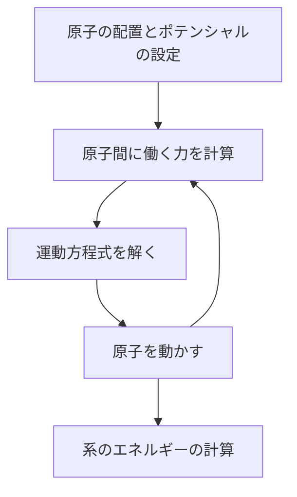
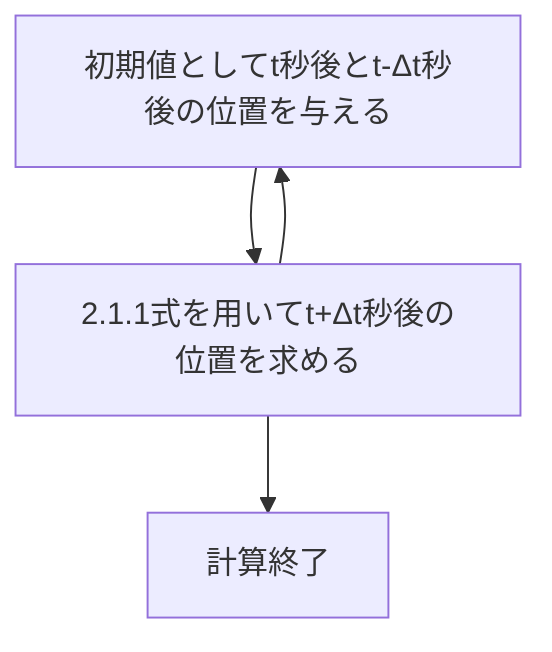
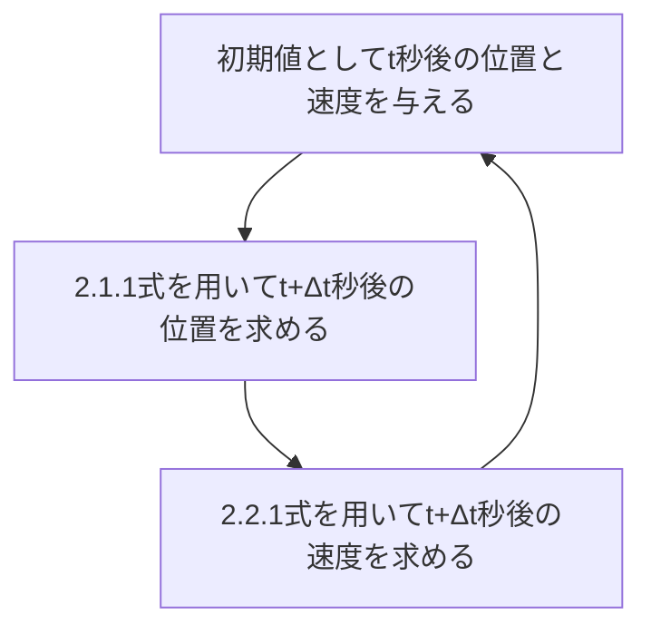

# Molecular Dynamics 理論
&emsp;本ドキュメントでは、LAMMPSやVASPを用いるにあたり、必要となるであろうMDの理論を説明する。参考文献は[先生が書いた本](https://www.morikita.co.jp/books/mid/092251)と筆者が作った[真空ゼミのスライド](https://waseda.app.box.com/file/1080558360236)である。後者については間違っている部分もあるので、前者を主に参考に

## 目次
1. [概要](#1-概要)
2. [運動方程式](#2-運動方程式)
3. [ポテンシャル](#3-ポテンシャル)
4. [系と周期的境界条件](#4-系と周期的境界条件)
5. [構造最適化](#5-構造最適化)
6. [温度制御](#6-温度制御)
7. [圧力制御](#7-圧力制御)

※クリックで各セクションへ移動可能

## 1. 概要
&emsp;MDとは、Molecular Dynamicsの頭文字をとっており、__分子動力学法__ と訳される。古典力学を用いたシミュレーション方法であり、主に原子間に働く力をポテンシャルから算出し、原子を動かしながら物性を予測するシミュレーションである。昨今では、今まで使われていた経験的ポテンシャルに代わり、機械学習ポテンシャルを用いた計算が主流となってきている。本ドキュメントでは、機械学習ポテンシャルには触れず、MDシミュレーションがどのような流れで行われているかについて述べる。  
　まずは、力学内でのMDの位置づけを見ていく。下の図を見てほしい。  
<div align = "center">
 
</div>   
この図は有名だが、量子力学や古典力学、連続体力学のシミュレーションの種類と、時間スケール、扱える原子数を示している。MDであれば、1ps~1nsスケールのシミュレーションを扱えるという意味である。 縦軸は計算コストではないので注意が必要である。また、研究の観点からの位置づけも見ていく。  
<div align = "center">

</div>  
このように、実験を行う前に理論に基づいた計算を行うことで、実験コストを最小限に抑えたり、危険性や毒性がある物質の取り扱いが容易となるのである。さて、本編に入る前に、MDシミュレーションの大まかな流れを最後に述べる。  



このフローチャートの中身についてこれから説明していくこととする。

## 2. 運動方程式
&emsp;順番は前後するが、まずは運動方程式について説明する。運動方程式がなぜ必要なのかというと、MDでは原子の座標の情報が必要不可欠だからである。原子にかかる力がわかれば、加速度がわかり、速度や $\Delta t$ 秒後の位置も求まるというのは想像に容易いだろう。  
<div align = "center">

</div>  
　さて、ポテンシャルから力を計算をすると述べた。大学物理の復習となるが、式で表すと次のようになる。  

$$  
\boldsymbol{F} = m \frac{d^2 \boldsymbol{r}}{dt^2}=-\frac{\partial V}{\partial \boldsymbol{r}}
$$  

ポテンシャルエネルギーは $V$ とした。このように、運動方程式を解くにはポテンシャルエネルギーが必須なのである。では、この運動方程式はどのようにMDシミュレーションで使われ、解かれるのか？  

### 2.1 Verlet法
　代表的な方法として、Verlet法と速度Verlet法がある。まずは、Verlet法において用いられる $\Delta t$ 秒後の位置を表す式を示す。  

$$  
\boldsymbol{r_i}(t+\Delta t) = 2\boldsymbol{r_i}(t)-\boldsymbol{r_i}(t-\Delta t)+(\Delta t)^2 \frac{\boldsymbol{F_i}(t)}{m} + O(\Delta t^3)\ \ \ \ \ \ \ \ (2.1.1)
$$  

太字はベクトル、添え字の $i$ は $i$ 番目の原子という意味である。つまり、(2.1.1)式を次のように繰り返し用いれば、原子座標を求めることが可能である。  



では、この式はどのように導かれるのか？  
　t+Δt秒後の位置とt-Δt秒後の位置をそれぞれΔt=0の周りで2次の項までテイラー展開すると、

$$  
\boldsymbol{r_i}(t+\Delta t)=\boldsymbol{r_i}+\Delta t\cdot
\frac{d\boldsymbol{r_i}}{dt} +(+\Delta t)^2 \frac{1}{2}\frac{d^2\boldsymbol{r_i}}{dt^2} + O(\Delta t^3)\ \ \ \ \ \ \ \ (2.1.2)
$$  

$$  
\boldsymbol{r_i}(t-\Delta t)=\boldsymbol{r_i}-\Delta t\cdot
\frac{d\boldsymbol{r_i}}{dt} +(-\Delta t)^2 \frac{1}{2}\frac{d^2\boldsymbol{r_i}}{dt^2}+ O(\Delta t^3)\ \ \ \ \ \ \ \ (2.1.3)
$$  

(2.1.2)式と(2.1.3)式を加算すると、  

$$  
\boldsymbol{r_i}(t+\Delta t)+\boldsymbol{r_i}(t-\Delta t)=2\boldsymbol{r_i}+(+\Delta t)^2\cdot\frac{d^2\boldsymbol{r_i}}{dt^2}+O(\Delta t^3)\ \ \ \ \ (2.1.4)
$$  

変形すると、  

$$  
\frac{d^2\boldsymbol{r_i}}{dt^2}=\frac{\boldsymbol{r_i}(t+\Delta t)+\boldsymbol{r_i}(t-\Delta t)-2\boldsymbol{r_i}}{(\Delta t)^2}++O(\Delta t)\ \ \ \ \ \ \ \ \ (2.1.5)
$$  

(2.1.5)式をNewtonの運動方程式に代入すると、  

$$  
\frac{\boldsymbol{F_i}(t)}{m}=\frac{\boldsymbol{r_i}(t+\Delta t)+\boldsymbol{r_i}(t-\Delta t)-2\boldsymbol{r_i}}{(\Delta t)^2}++O(\Delta t)\ \ \ \ \ \ \ \ \ (2.1.6)
$$  

(2.1.6)式を変形すれば、  

$$  
\boldsymbol{r_i}(t+\Delta t) = 2\boldsymbol{r_i}(t)-\boldsymbol{r_i}(t-\Delta t)+(\Delta t)^2 \frac{\boldsymbol{F_i}(t)}{m} + O(\Delta t^3)\ \ \ \ \ \ \ \ (2.1.1)
$$  

と導かれる。

### 2.2 速度Verlet法
&emsp;速度Verlet法はVerlet法の発展形と思ってほしい。式の形は、  

$$  
\boldsymbol{r_i}(t+\Delta t) = 2\boldsymbol{r_i}(t)-\boldsymbol{r_i}(t-\Delta t)+(\Delta t)^2 \frac{\boldsymbol{F_i}(t)}{m} + O(\Delta t^3)\ \ \ \ \ \ \ \ (2.1.1)
$$  

$$  
\boldsymbol{v_i}(t+\Delta t) = \boldsymbol{v_i}(t)+\Delta t\cdot \frac{\boldsymbol{F_i}(t)}{m}+\frac{\Delta t}{2m}\left[ \boldsymbol{F_i}(t+\Delta t)-\boldsymbol{F_i}(t) \right]+O(\Delta t^3)\ \ \ \ \ \ \ \ (2.2.1)
$$  

新たに、(2.2.1)式が追加されている。Verlet法と異なり、速度の情報も導かれることがわかる。この2式を使う流れとしては、  



　
では、式の導出を行う。その際、__前進差分近似と後進差分近似__ という数学の手法を知る必要があるので、先に解説する。t+Δt秒後の位置とt-Δt秒後の位置をそれぞれΔt=0の周りで1次の項までテイラー展開すると、

$$  
\boldsymbol{r_i}(t+\Delta t)=\boldsymbol{r_i}+\Delta t\cdot
\frac{d\boldsymbol{r_i}(t)}{dt} + O(\Delta t^2)\ \ \ \ \ \ \ \ (2.2.2)
$$  

$$  
\boldsymbol{r_i}(t-\Delta t)=\boldsymbol{r_i}-\Delta t\cdot
\frac{d\boldsymbol{r_i}(t)}{dt} + O(\Delta t^2)\ \ \ \ \ \ \ \ (2.2.3)
$$  

となる。それぞれの式を変形すると、  

$$  
\frac{d\boldsymbol{r_i}}{dt} = \frac{\boldsymbol{r_i}(t+\Delta t)-\boldsymbol{r_i}(t)}{\Delta t} + O(\Delta t)\ \ \ \ \ \ \ \ (2.2.4)
$$  

$$  
\frac{d\boldsymbol{r_i}}{dt} = \frac{\boldsymbol{r_i}(t)-\boldsymbol{r_i}(t-\Delta t)}{\Delta t} + O(\Delta t)\ \ \ \ \ \ \ \ (2.2.5)
$$  

(2.2.4)式は後ほど使用する。では、まず、t+Δt秒後の位置と速度をΔt=0の周りで2次までテイラー展開すると、  

$$  
\boldsymbol{r_i}(t+\Delta t)=\boldsymbol{r_i}+\Delta t\cdot\boldsymbol{v_i}(t) +(+\Delta t)^2 \frac{\boldsymbol{F_i}(t)}{m} + O(\Delta t^3)\ \ \ \ \ \ \ \ (2.2.6)
$$  

$$  
\boldsymbol{v_i}(t+\Delta t)=\boldsymbol{r_i}+\Delta t\cdot
\frac{\boldsymbol{F_i}(t)}{m} +(+\Delta t)^2 \frac{1}{2m}\frac{d\boldsymbol{F_i}}{dt} + O(\Delta t^3)\ \ \ \ \ \ \ \ (2.2.7)
$$  

(2.2.4)式を(2.2.7)式の右辺第3項に適用すると、  

$$  
\boldsymbol{v_i}(t+\Delta t)=\boldsymbol{r_i}+\Delta t\cdot
\frac{\boldsymbol{F_i}(t)}{m} +\frac{\Delta t}{2m}\left[\boldsymbol{F_i}(t+\Delta t)-\boldsymbol{F_i}(t)\right] + O(\Delta t^3)\ \ \ \ \ \ \ \ (2.2.1)
$$  

これで導出は完了である。

## 3. ポテンシャル
&emsp;前の節で述べた通り、運動方程式の利用にはポテンシャルエネルギーが必要不可欠である。昨今では、機械学習ポテンシャルを作成し、計算を行う場合も出てきているが、それまでは経験的ポテンシャルというものが用いられていた。検索するだけで様々な種類のポテンシャルが出てくるが、本ドキュメントでは、いくつか抜粋して紹介するにとどめる。なお、機械学習ポテンシャルについては別のドキュメントで触れることとする。  
　紹介の前に、ポテンシャルそのものについて説明する。頭の中で、原子が64個ある系を想像してほしい。__原子1個に注目したとき、__ 相互作用はどうなっているだろう？2体系は63個あり、3体系は1935個ある。4体系等も考えていくと大変なことになる。  

```math
E_{total} = \sum_{j=2}^N \sum^{j-1}_{i=1}V_2(\boldsymbol{r_i, r_j})+\sum_{k=3}^N\sum_{j=2}^{k-1} \sum^{j-1}_{i=1}V_3(\boldsymbol{r_i, r_j, r_k}) + \cdots + V_N(\boldsymbol{r_1, r_2,\cdots, r_N})
``` 

相互作用は系の拡張によりどんどん大きくなっていくので、近似を行うことで系の拡張にも対応できるようにしなければならない。詳しい近似の内容は、ポテンシャルや適用したい系などにより異なるので適宜確認しなければならない。

### 3.1 Coulomb ポテンシャル
&emsp;電荷をもつ物体同士に働く相互作用であり、  

$$  
V=\frac{1}{4\pi\epsilon}\frac{Z_1Z_2}{|\boldsymbol{r_{21}}|}\ \ \ \ \ \ \ \ (3.1.1)
$$  

$\epsilon$ は誘電率、$\boldsymbol{r_{21}}$ は粒子間距離、Zは電荷を表す。電磁気学で学習済みだと思うので特に詳しい説明はしない。

### 3.2 Stilinger-Weber ポテンシャル
&emsp;SWポテンシャルと略されることもあるポテンシャルで、主にダイアモンド構造を取るⅣ族原子やその混晶、共有結合結晶に適用される。式としては、  

$$  
V(r)=\epsilon\sum_i\sum_{j>i}f_2\left(\frac{r_{ij}}{\sigma}\right)+\epsilon\sum_i\sum_{j>i}\sum_{k>j}f_3\left(\frac{\boldsymbol{r_i}}{\sigma}, \frac{\boldsymbol{r_j}}{\sigma}, \frac{\boldsymbol{r_k}}{\sigma}\right)\ \ \ \ \ \ \ \ (3.2.1)
$$  

$$  
f_2(r)=A\left(Br^{-p}-r^{-q}\right) exp \left( \frac{\delta}{r-a} \right)\ \ \ \ \ \ \ \ \ \ \ \ \ \ \ \ (3.2.2)
$$  

$$  
f_3\left(\boldsymbol{r_i}, \boldsymbol{r_j}, \boldsymbol{r_k}\right)= h(r_{ij}, r_{ik}, \theta_{jik})+h(r_{ji}, r_{jk}, \theta_{ijk})+h(r_{ki}, r_{kj}, \theta_{ikj})\ \ \ \ (3.2.3)
$$  

$$  
h(r_{ij}, r_{ik}, \theta_{jik})=\lambda exp\left[ \left(\frac{\gamma}{r_{ij}-a}\right)+\left(\frac{\gamma}{r_{ik}-a}\right) \right]\left( cos\theta_{jik}+\frac{1}{3} \right)^2\ \ \ \ (3.2.4)
$$  

各パラメータについては以下の表のとおり。 
|記号|単位|意味|
|:--:|:--:|:--:|
|$a$|Å|カットオフ距離|
|$\epsilon$|eV|結合の強さによるパラメータ|
|$\sigma$|Å|原子の大きさに依るパラメータ|
|$A, B, p, q, \delta, \lambda, \gamma$|$L^0M^0T^0$|フィッティングで決定されるパラメータ|

2体系と3体系の２つで構成されているため、4体系以降は考えない。  

### 3.3 Lennard-Jones ポテンシャル
&emsp;アルゴンなどの希ガスを対象とした2体間相互作用ポテンシャルであり、式は、

$$  
V(r)=4\epsilon\left[ \left( \frac{\sigma}{r} \right)^6 - \left( \frac{\sigma}{r} \right)^{12}\right] \ \ \ \ \ \ \ \ (3.3.1)
$$  

各パラメータについては以下の表のとおり。 
|記号|単位|意味|
|:--:|:--:|:--:|
|$\epsilon$|eV|エネルギーの最小値の値|
|$\sigma$|Å|原子の大きさに依るパラメータ|

ポテンシャルのカーブは次のようになる。  
<div align = "center">

</div>

### 3.4 Born-Mayer-Huggins ポテンシャル
&emsp;イオン結晶を対象としたポテンシャルであり、式は、

$$  
V(r)= \frac{Z_iZ_j e^2}{4\pi\epsilon r}+A_{ij}b\cdot exp\left( \frac{\sigma_i+\sigma_j-r_{ij}}{\rho} \right)-\frac{C_{ij}}{r_{ij}^6}-\frac{D_{ij}}{r_{ij}^8} \ \ \ \ \ \ (3.4.1)
$$  

各パラメータについては以下の表のとおり。 
|記号|単位|意味|
|:--:|:--:|:--:|
|$e$|$C$|電気素量(1.60217662)|
|$Z_i, Z_j$||イオンの価数|
|$r_{ij}$|Å|イオン間距離|
|$A_{ij}$||ポーリング因子|
|$b$||反発力に依るパラメータ|
|$\sigma_i, \sigma_j$||原子の大きさに依るパラメータ|
|$\rho$||ソフトネスパラメータ|

## 4. 系と周期的境界条件
&emsp;では、計算の対象となる系にはどのような制限や条件が課されているか見てみよう。まず、実際に使用する構造の図を示す。  
<div align = "center">  

</div>  
これだけ見ると、「え？こんだけの原子数の構造を計算して何になるの？意味なくね？」と思うかもしれない。しかし、計算を行う際には、この構造に対し、周期的境界条件というものが課される。  
　この節では、「既約表現論」の内容を復習しつつ、MD計算と対象となる系、その後に周期的境界条件について説明する。  

### 4.1 系
&emsp;さて、既約表現論や材料科学概論の内容を復習していこう。MD計算では、単体や多元系のアモルファスや結晶のエネルギーや力などの物理量を計算する。計算班では、Materials Projectや[自作のプログラム群](https://github.com/MDGroup-WatanabeLab/mdpython)で結晶構造を作成している。なので、三方晶や立方晶、六方晶などの知識が必要となってくるのである。したがって、この節では、7晶系やfccなどのよく出てくる結晶系の構成について簡単に復習する。  
　ではまず、7晶系である。下の表を見ながら思い出してほしい。


|晶系|軸|軸角|ブラベー格子|
|:-:|:-:|:-:|:-:|
|三斜|$a\not ={b\not ={c}}$|$\alpha\not ={\beta\not ={\gamma}}$|P|
|単斜|$a\not ={b\not ={c}}$|$\alpha=\gamma=90\degree$|P, C|　
|直方（斜方）|$a\not ={b\not ={c}}$|$\alpha=\beta=\gamma=90\degree$|P, C, I, F|　
|正方|$a=b$|$\alpha=\beta=\gamma=90\degree$|P, I|　
|三方|$a=b=c$|$\alpha=\beta=\gamma$|R|　
|六方|$a=b$|$\alpha=\beta=90\degree, \gamma=120\degree$|P|　
|立方（等軸）|$a=b=c$|$\alpha=\beta=\gamma=90\degree$|P, I, F|　

※ P：単純、C：底心、I：体心、F：面心、R：菱面体 を表す  

次に、代表的な結晶構造について見ていく。

|構造名|原子配置|例|
|:-:|:-:|:-:|
|NaCl型|$A(0, 0, 0), A(0, \frac{1}{2}, \frac{1}{2}), A(\frac{1}{2}, 0, \frac{1}{2}), A(\frac{1}{2}, \frac{1}{2}, 0)$<br> $B(\frac{1}{2}, 0, 0), B(0, \frac{1}{2}, 0), B(0, 0, \frac{1}{2}), B(\frac{1}{2}, \frac{1}{2}, \frac{1}{2})$|NaCl, KCl|
|FCC（面心立方）|$(0, 0, 0), (\frac{1}{2}, \frac{1}{2}, 0), (\frac{1}{2}, 0, \frac{1}{2}), (0, \frac{1}{2}, \frac{1}{2})$|Al, Cu|
|BCC（体心立方）|$(0, 0, 0), (\frac{1}{2}, \frac{1}{2}, \frac{1}{2})$|Fe, Cr|
|HCP（六方最密充填構造）|$(0, 0, 0), (\frac{1}{3}, \frac{2}{3}, \frac{1}{2})$|Mg, Zr|
|ダイアモンド型|$(0, 0, 0), (0, \frac{1}{2}, \frac{1}{2}), (\frac{1}{2}, 0, \frac{1}{2}), (\frac{1}{2}, \frac{1}{2}, 0)$<br>$(\frac{1}{4}, \frac{1}{4}, \frac{1}{4}), (\frac{1}{4}, \frac{3}{4}, \frac{3}{4}), (\frac{3}{4}, \frac{1}{4}, \frac{3}{4}), (\frac{3}{4}, \frac{3}{4}, \frac{1}{4})$|C, Si|
|CsCl型|$A(0, 0, 0), B(\frac{1}{2}, \frac{1}{2}, \frac{1}{2})$|CsCl, CsBr|

このような構造はわかっておいた方が良いだろう。計算する際は、上記の単位胞をxyz方向にそれぞれ2倍、3倍して拡張した系を使用する。実際、先ほど示した結晶はGeのダイアモンド型構造を2×2×2したものである。

### 4.2 周期的境界条件
&emsp;では、本題の周期的境界条件について説明する。この周期的境界条件を用いる一番の理由は、__表面効果を無視できる__ からである。表面効果というのは、文字通り、結晶などの表面においてのみ見られる特別な現象のことをいう。SiやGeの結晶構造であれば、表面付近の原子間の結合数は4個から1個や2個に減ることとなり、通常よりも原子が動きやすくなってしまう。それは、バルクの計算としては不適切な結果が得られてしまうと考えられる。  
　したがって、MD計算を行う際は、原子が格子を飛び出した場合はその逆から原子が入ってくるといった形を取ることで、格子が無限に続いている状態を再現しているのである。下の図の赤い枠の格子をオリジナルセル、その他の青枠の格子をイメージセルと呼ぶ。  

<div align = "center">  

</div>  

&emsp;しかし、この話を聞いて勘のいい人は、「え？無限に格子が続いていると仮定したら、エネルギーの値やばくね？」と考えるだろう。そのとおりであり、このままではエネルギーの値が非常に大きくなり、計算コストも爆上がりしてしまうことはすぐにわかる。この問題を解決するために用いられるのが __カットオフ距離とEwald法__ である。  

### 4.3 エネルギーのカットオフ
&emsp;というわけで、まずはカットオフについて説明する。カットオフ距離については、少々注意する必要がある。下の図を見てほしい。

<div align = "center">  

</div>  

このように、カットオフ距離が大きすぎると、ポテンシャルエネルギーが重複されて計算されてしまうため、単位胞の大きさの半分以下の長さにすることが好ましいと言える。ここで、勘のいいひとは、「え？そんなことしたら逆にエネルギーが本来よりも小さく出てくるのでは？」と考えるだろう。これを解決するのが、__Ewald法__ である。  

### 4.4 Ewald法
&emsp;というわけで、エネルギーのカットオフにおいて必要不可欠なEwald法について説明する。先述したクーロンポテンシャルの式は、

$$  
V=\frac{1}{4\pi\epsilon}\frac{Z_1Z_2}{|\boldsymbol{r_{21}}|}\ \ \ \ \ \ \ \ (3.1.1)
$$  

であった。この式から、クーロンポテンシャルは距離の逆数 $\frac{1}{r}$ に比例した関数であるとわかる。しかし、この関数は下記の通りの形をとり、減衰しづらいことがわかる。  

<div align = "center">  

</div>  

減衰しづらいということは、カットオフ距離より外側でエネルギーを０と近似したときの誤差が大きくなってしまうと言える。したがって、クーロンポテンシャルのような減衰しづらいポテンシャルは計算方法を工夫しなければならないとわかる。この工夫こそがEwald法である。今後、この節では、全ポテンシャルエネルギーを $V(r)$ として説明していく。  
　今回は、電荷中性条件が成り立っており、N個のイオンが存在する体積 $L^3$ のユニットセルを考える。まず、前述の通り、ポテンシャルは減衰しやすいものと減衰しづらいものの2つに分けられるので、次の式のように分解する。  

$$  
V(r) = V^{(r)}(r) + V^{(k)}(r) + V^{(s)}(r) + V^{(d)}(r)\ \ \ \ \ \ \ \ (4.4.1)
$$  

それぞれの項は、実空間で早期収束、逆空間で早期収束、自己エネルギー、双極子による補正項を表す。それぞれの中身は、  

$$  
V^{(r)}(r)= \frac{1}{2} \sum_n \sum^N_{i=1} \sum^N_{j=1}\frac{e^2}{4\pi\epsilon}\frac{Z_iZ_j}{|\boldsymbol{r_{ij}}+L\boldsymbol{n}|}\cdot erfc(\alpha |\boldsymbol{r_{ij}}+L\boldsymbol{n}|)\ \ \ \ \ \ \ \ (4.4.2)
$$  

$$  
V^{(k)}(r)= \frac{1}{2L^3}\sum_{\boldsymbol{k\not ={0}}} \frac{4\pi}{k^2}e^{-k^2/4\alpha^2}|\tilde{\rho}(\boldsymbol{k})|^2\ \ \ \ \ \ \ \ (4.4.3)
$$  

$$  
V^{(s)}(r)=-\frac{\alpha}{\sqrt{\pi}}\sum^N_{i=1} Z_i^2\ \ \ \ \ \ \ \ \ \ \ \ \ \ \ \ \ \ \ \ \ \ \ \ \ \ \ \ \ \ (4.4.4)
$$  

$$  
V^{(d)}(r)=\frac{2\pi}{(1+2\epsilon')L^3}\left( \sum^N_{i=1} Z_i\boldsymbol{r_i} \right)^2\ \ \ \ \ \ \ \ (4.4.5)
$$  

ここで、各記号の意味は、
  
|記号|単位|意味|
|:-:|:-:|:-:|
|L|Å|単位胞の長さ|
|$\alpha$|$L^{-1}$|Ewaldパラメータ|

また、  

$$  
erfc(r) = \frac{2}{\sqrt{\pi}} \int^{\infty}_r e^{-t^2}dt\ \ \ \ \ \ \ \ (4.4.6)
$$  

$$  
\boldsymbol{k} = \frac{2\pi \boldsymbol{m}}{L}\ \ \ \ \ \ \ \ (4.4.7)
$$  

$$  
\boldsymbol{n} = \left[
    \begin{matrix}
    n_x \\
    n_y \\
    n_z   
    \end{matrix}
\right]\ \ \ \ \ \ \ \ (4.4.8)
$$  

それぞれ、相補誤差関数、波数ベクトル、イメージセルのインデックスを表す整数ベクトルである。さらに、 $\tilde{\rho}(\boldsymbol{k})$ は電荷密度のフーリエ変換を表すので、  

$$  
\tilde{\rho}(\boldsymbol{k}) = \int_V d\boldsymbol{r} \rho(\boldsymbol{r})e^{-i\boldsymbol{k}\cdot\boldsymbol{r}}=\sum^N_{j=1}Z_je^{-i\boldsymbol{k}\cdot\boldsymbol{r_j}} \ \ \ \ \ \ \ (4.4.9)
$$  

と表される。  
　では、エネルギーを分解したところで、偏微分してイオン $i$ にかかる力を求めよう。自己エネルギーは力に寄与しないので、  

$$  
\boldsymbol{F_i}=-\frac{\partial E^{(r)}}{\partial \boldsymbol{r_i}}-\frac{\partial E^{(k)}}{\partial \boldsymbol{r_i}}-\frac{\partial E^{(d)}}{\partial \boldsymbol{r_i}}\ \ \ \ \ \ \ (4.4.10)
$$  

さて、中身はどうなっているかというと、


$$  
-\frac{\partial E^{(r)}}{\partial \boldsymbol{r_i}}= \frac{e^2}{4\pi\epsilon} \sum_n \sum^N_{j=1}Z_iZ_j  \left(\frac{2\alpha}{\sqrt{\pi}} exp\left(-\alpha^2|\boldsymbol{r_{ij}}+L\boldsymbol{n}|^2\right)+\frac{erfc(\alpha |\boldsymbol{r_{ij}}+L\boldsymbol{n}|)}{|\boldsymbol{r_{ij}}+L\boldsymbol{n}|}\right)\frac{\boldsymbol{r_{ij}}+L\boldsymbol{n}}{|\boldsymbol{r_{ij}}+L\boldsymbol{n}|^2}\ \ \ \ \ \ \ \ (4.4.11)
$$  

$$  
-\frac{\partial E^{(k)}}{\partial \boldsymbol{r_i}}= \frac{1}{L^3}\sum_{j=1}^N Z_iZ_j \sum_{\boldsymbol{k\not ={0}}} \frac{4\pi\boldsymbol{k}}{k^2}e^{-k^2/4\alpha^2}sin(\boldsymbol{k\cdot r_{ij}})\ \ \ \ \ \ \ \ (4.4.12)
$$  

$$  
-\frac{\partial E^{(d)}}{\partial \boldsymbol{r_i}}=\frac{4\pi Z_i}{(1+2\epsilon')L^3} \sum^N_{j=1} Z_j\boldsymbol{r_j}\ \ \ \ \ \ \ \ (4.4.13)
$$  

このように分解し、エネルギーを早期に減衰させることで、エネルギーを計算している。

## 5. 構造最適化
MD計算をする際、初期構造が不安定なもの（原子間距離が近すぎてポテンシャルが大きいなど）のとき、温度が10万Kなどに上昇して計算が終了してしまうことがある。もちろん、毎回行わなければいけないわけではないが、行った方が良い。この構造最適化についても、いくつか方法があるが、このドキュメントでは __最急降下法__ と __共役勾配法__ について紹介する。

### 5.1 最急降下法

### 5.2 共役勾配法

## 6. 温度制御
まず、MD計算において温度がどのように定義されているかを説明する。系の温度Tは、  

$$  
T \equiv \frac{2}{3Nk_B} \sum_{i=1}^N \frac{1}{2}m_iv_i^2
$$  

とあらわされ、__運動学的温度__ と呼ばれる。熱力学で定義されている、__熱力学温度__ とは異なるので注意である。  
　温度がT一定の系に対して温度を制御する際は、系が温度Tの無限に大きい熱浴に浸かって熱平衡状態になっていると考えられる。このドキュメントでは、__Langevin法、能勢法、能勢-Hoover法__ の3つを紹介する。

### 6.1 Langevin法
ブラウン運動を記述する確率微分方程式であるLangevin方程式を数値的に解く方法が、Langevin法である。この方程式は、  

$$  
m_i \frac{d^2 \boldsymbol{r_i}}{dt^2}=-\frac{\partial E_{total}}{\partial \boldsymbol{r_i}}-\xi\frac{d\boldsymbol{r_i}(t)}{dt}+\boldsymbol{R}(t)\ \ \ \ \ \ \ \ (6.1.1)
$$  

それぞれの項は、原子間相互作用、摩擦力、原子を動かす振動力に起因する力を表す。このうち、第2項と第3項は熱浴との相互作用を表し、  

$$  
\left< R(t) \right>=0\ \ \ \ \ \ \ \ (6.1.2)
$$  

$$  
\left< R(t)R(t') \right>=2\xi k_B T_{set} \delta(t-t')\ \ \ \ \ \ \ \ (6.1.3)
$$  

を満たしている。また、 $T_{set}$ は設定温度である。  
　この方程式を解くためには、M. P. Allen が提案したAllenのアルゴリズムが用いられる。

$$  
\boldsymbol{r_i}(t+\Delta t)=\boldsymbol{r_i}(t)+c_1\Delta t\cdot\boldsymbol{v_i}(t) +c_2(+\Delta t)^2 \frac{\boldsymbol{F_i}(t)}{m_i} + \delta\boldsymbol{r}^G\ \ \ \ \ \ \ \ (6.1.4)
$$  

$$  
\boldsymbol{v_i}(t+\Delta t)=c_0\boldsymbol{r_i}(t)+(c_1-c_2)\Delta t\cdot
\frac{\boldsymbol{F_i}(t)}{m_i} + c_2\Delta t \frac{\boldsymbol{F_i}(t+\Delta t)}{m_i} + \delta\boldsymbol{v}^G\ \ \ \ \ \ \ \ (6.1.5)
$$  

各係数は、  

$$  
c_0 = e^{-\xi\Delta t}, \ \ c_1=\frac{1-c_0}{\xi \Delta t}, \ \ c_2=\frac{1-c_1}{\xi \Delta t}\ \ \ \ \ \ \ \ (6.1.6)
$$  

さらに、$\delta\boldsymbol{r}^G, \delta\boldsymbol{v}^G$ の分散はそれぞれ、  

$$  
\sigma_{\boldsymbol{r}}^2=\Delta t \frac{k_b T}{m\xi}\{ 2-\frac{1}{m\xi}(3-4e^{-\xi\Delta t}+e^{-2\xi\Delta t})\}\ \ \ \ \ \ \ \ (6.1.7)
$$  

$$  
\sigma_{\boldsymbol{v}}^2=\frac{k_BT}{m}(1-e^{-2\xi\Delta t})\ \ \ \ \ \ \ \ (6.1.8)
$$  

### 6.2 能勢法
次に、能勢法について説明する。これは、新たな力学変数を与えて（拡張系という）温度を制御する方法である。特徴的なのは、時間をスケーリングして系の温度制御を実現している点である。拡張系の時間変数を $t$ 、原子集団の現実系の時間変数を $t'$ 、スケーリング因子を $s$ とすると、  

$$  
dt' = \frac{dt}{s}\ \ \ \ \ \ \ \ (6.2.1)
$$  

これにより、各粒子の現実系の速度ベクトルは、  

$$  
\boldsymbol{v}'_i = s \dot{\boldsymbol{r}}_i\ \ \ \ \ \ \ \ (6.2.2)
$$  

つまり、sの値が変化すると、現実系の運動学的温度も変化するので、熱浴と系の間の熱エネルギーの交換を表現できていることになる。そして、ラグランジアンLは、系の自由度を表す無次元パラメータ $g$ を用いて、  

```math  
L=\sum^N_{i=1}\frac{m_i}{2}s^2\dot{\boldsymbol{r}}_i^2-E_{total}+\frac{Q}{2}\dot{s}^2-gk_BT_{set}\ ln\ s\ \ \ \ \ \ \ \ (6.2.3)
```  

第3項はsの運動エネルギーを表し、Qは質量を表す。第4項はsのポテンシャルエネルギーである。このラグランジアンを用いて、Euler-Lagrangeの運動定式より、 $\boldsymbol{r_i}, s$ の運動方程式は、  

```math  
m_i\ddot{\boldsymbol{r}}_i = -\frac{1}{s^2}\frac{\partial E_{total}}{\partial \boldsymbol{r}_i}-m_i \frac{2\dot{s}}{s}\dot{\boldsymbol{r}}_i\ \ \ \ \ \ \ \ (6.2.4)
```  

```math  
Q\ddot{s}=\sum^N_{i=1}m_i s \dot{\boldsymbol{r}}_i^2-\frac{gk_BT_{set}}{s}\ \ \ \ \ \ \ \ (6.2.5)
```  

と書ける。能勢法におけるMDでは、この運動方程式を解くことで温度を制御している。

### 6.3 能勢-Hoover法
最後に、能勢-Hoover法の説明をする。まず、原子N個と $s$ の拡張系のハミルトニアンは、  

$$  
H=\sum_{i=1}^N \frac{\boldsymbol{p}_i^2}{2m_is^2}+E_{total}+\frac{p_s^2}{2Q}+gk_BT_{set}\cdot ln\ s\ \ \ \ \ \ \ \ (6.3.1)
$$  

と書け、このハミルトニアンから得られる正準方程式は、

$$  
\frac{d\boldsymbol{r}_i}{dt}=\frac{\partial H}{\partial \boldsymbol{p}_i}=\frac{\boldsymbol{p}_i}{m_is^2}\ \ \ \ \ \ \ \ (6.3.2)
$$  

$$  
\frac{d\boldsymbol{p}_i}{dt}=-\frac{\partial H}{\partial \boldsymbol{r}_i}=-\frac{\partial E_{total}}{\partial \boldsymbol{r}_i}\ \ \ \ \ \ \ \ (6.3.3)
$$  

$$  
\frac{ds}{dt}=\frac{\partial H}{\partial p_s}=\frac{p_s}{Q}\ \ \ \ \ \ \ \ (6.3.4)
$$  

$$  
\frac{dp_s}{dt}=-\frac{\partial H}{\partial s}=\frac{1}{s}\left( \sum^N_{i=1} \frac{\boldsymbol{p}_i^2}{m_is}-gk_BT_{set} \right)\ \ \ \ \ \ \ \ (6.3.5)
$$  

ここで、スケーリング因子を用いて拡張系から現実系へ変換すると、

$$  
\boldsymbol{r}_i' = \boldsymbol{r}_i\ , \ p_s'=\frac{p_s}{s}\ ,\ s'=s\ ,\ dt'=\frac{dt}{s}\ \ \ \ \ \ \ \ (6.3.6)
$$  

を用いて、

$$  
\frac{d\boldsymbol{r}_i'}{dt'}=\frac{\boldsymbol{p}_i'}{m_i}\ \ \ \ \ \ \ \ (6.3.7)
$$  

$$  
\frac{d\boldsymbol{p}_i'}{dt'}=-\frac{\partial E_{total}}{\partial \boldsymbol{r}_i'}-\frac{1}{s'}\frac{ds'}{dt'}\boldsymbol{p}_i'\ \ \ \ \ \ \ \ (6.3.8)
$$  

$$  
\frac{ds'}{dt'}=s'^2\frac{p_s'}{Q}\ \ \ \ \ \ \ \ (6.3.9)
$$  

$$  
\frac{dp_s'}{dt'}=-\frac{\partial H}{\partial s}=\frac{1}{s'}\left( \sum^N_{i=1} \frac{\boldsymbol{p}_i'^2}{m_i}-gk_BT_{set} \right)-\frac{1}{s'}\frac{ds'}{dt'}p_s'\ \ \ \ \ \ \ \ (6.3.10)
$$  

と書き直せる。この式に対し、W. G. Hooverは新たな変数として、  

$$  
\zeta = \frac{1}{s'}\frac{ds'}{dt'}=\frac{s'p_s'}{Q}\ \ \ \ \ \ \ \ (6.3.11)
$$  

を提案した。この ζ により、(6.3.7)～(6.3.10)式は、次のように書き直せる。  

$$  
\frac{d\boldsymbol{r}_i'}{dt'}=\frac{\boldsymbol{p}_i'}{m_i}\ \ \ \ \ \ \ \ (6.3.12)
$$  

$$  
\frac{d\boldsymbol{p}_i'}{dt'}=-\frac{\partial E_{total}}{\partial \boldsymbol{r}_i'}-\zeta\boldsymbol{p}_i'\ \ \ \ \ \ \ \ (6.3.13)
$$  

$$  
\frac{d\ ln s'}{dt'}=\zeta\ \ \ \ \ \ \ \ (6.3.14)
$$  

$$  
\frac{d\zeta}{dt'}=\frac{1}{Q}\left( \sum^N_{i=1} \frac{\boldsymbol{p}_i'^2}{m_i}-gk_BT_{set} \right)\ \ \ \ \ \ \ \ (6.3.15)
$$ 

(6.3.12)と(6.3.13)式は、[Langevin方程式](#61-langevin法)と同様、摩擦力を考慮した運動方程式であり、ζ が摩擦係数として、(6.3.15)式に依って変化する。  
　さて、(6.3.15)式に注目してほしい。系の自由度は、原子数が N なら $g=3N$ となる。そして、 $\sum^N_{i=1} \frac{\boldsymbol{p}_i'^2}{m_i}$ は運動学的温度であった。したがって、次のように書き直せる。  

$$  
\frac{d\zeta}{dt'}=\frac{1}{Q}\left(T-3Nk_BT_{set} \right)\ \ \ \ \ \ \ \ (6.3.16)
$$ 

(6.3.16)式からは、次のことがわかる。

- $\zeta$ は運動学的温度が目的の温度より高いと増加、低いと減少
- (6.3.13)式より、 $\zeta$ が増加すると運動学的温度が低下、減少すると運動学的温度が上昇

以上2つの点から、 $\zeta$ によって、運動学的温度に対し、一定値の周辺にのみ変化を許すフィードバックがもたらされることが読み取れる。実際のMDをした際の温度変化のグラフは下のようになっている。  

<div align = "center">  

</div>  

このように、温度がある程度変化しながら温度は上昇している様子がわかる。  
　さらに、この $\zeta$ を複数にし、原子と複数の熱浴の相互関係を記述することも可能である。原子を複数の別の熱浴に分割して入れたり、熱浴を別の熱浴の中にいれる系を記述することも可能となる。

## 7. 圧力制御
まず、MD計算において圧力がどのように定義されているかを説明する。系の圧力Pは、  

$$  
P \equiv \frac{1}{3V}\left< \sum^N_{i=1} m\boldsymbol{v_i}^2 \right> + \frac{1}{3V}\left< \sum^N_{i=1} m\boldsymbol{r_i\cdot f_i}^{int} \right>\ \ \ \ \ \ (7.1)
$$  

$\boldsymbol{f}_i^{int}$ は原子間相互作用による力で、このPは、__内圧__ と呼ばれる。式(7.1)から、系の体積が運動すると考えれば圧力制御ができると考えた、__Andersen法__ を紹介したのち、立方体セルのみでなく任意の平行六面体にも適用可能にした __Parrinello-Rahman法__ を紹介して終わります。  

### 7.1 Andersen法
まず、相似形変化のみ許された体積Vの立方体で、原子数Ｎのオリジナルセルを考える。この系において、原子間距離を規格化するため、原子座標を次のように無次元の単位として規格化する。  

$$  
\boldsymbol{r}_i' = \frac{\boldsymbol{r}_i}{V^{\frac{1}{3}}}\ \ \ \ \ \ (7.1.1)
$$  

拡張系のラグランジアンを定義すると、  

$$  
L=\sum_{i=1}^N \frac{1}{2}m_i V^{\frac{2}{3}}\boldsymbol{r}_i'^2-E_{total}(V^{\frac{1}{3}}\boldsymbol{r}_1',V^{\frac{1}{3}}\boldsymbol{r}_2', \cdots , V^{\frac{1}{3}}\boldsymbol{r}_N')+\frac{1}{2}W\dot{V}^2-P_{set}V  \ \ \ \ \ \ (7.1.2)
$$  

第1項と第2項は通常のラグランジアンと同じである。しかし、第3項と第4項は少々様相が異なる。第3項は、体積Vの変化のしやすさを定めるパラメータで質量にあたる。また、第4項は設定外圧 $P_{set}$ によるポテンシャルエネルギーを表す。  
　さて、温度制御のときと同様、Euler-Lagrange方程式より原子座標 $\boldsymbol{r}_i'$ と体積Vのそれぞれの運動方程式は、  

$$  
m_i \ddot{\boldsymbol{r}}_i' = -\frac{1}{V^{\frac{1}{3}}}\frac{\partial E_{total}}{\partial \boldsymbol{r}_i}-\frac{2}{3}m_i \frac{\dot{V}}{V}\dot{\boldsymbol{r}}_i'\ \ \ \ \ \ (7.1.3)
$$  

$$  
W\ddot{V}=\frac{1}{3V}\left[ \sum_{i=1}^N m_i V^{\frac{2}{3}}\boldsymbol{r}_i'^2 + \sum_{i=1}^N V^{\frac{1}{3}}\boldsymbol{r}_i' \cdot \left( -\frac{\partial E_{total}}{\partial \boldsymbol{r}_i} \right) \right]-P_{set}\ \ \ \ \ \ (7.1.4)
$$  

この運動方程式を解くことで圧力制御ができる。(7.1.4)式を見ると、右辺第1項が系の内圧に対応している（系のエネルギー÷系の体積＝内圧）ので、系の圧力が設定値 $P_{set}$ より大きければVを大きく、設定値 $P_{set}$ より小さければVを小さくすることで圧力を制御しているのである。

### 7.2 Parrinello-Rahman法
&emsp;先ほどのAndersen法の大きな欠点は、__単位胞が立方体のときにしか適用できないこと__ である。これを解決するのがParrinello-Rahman法である。この方法は、立方体のみならず、平行六面体にも適用可能である。そのため、平行六面体の単位胞を張る3つのベクトル $\boldsymbol{u_1, u_2, u_3}$ を定義し、原子座標を次のようにベクトルの線形結合で表す。  

$$  
\boldsymbol{r}_i = \boldsymbol{u_1}r_{i1}' + \boldsymbol{u_2}r_{i2}' + \boldsymbol{u_3}r_{i3}'=\boldsymbol{hr}_i'\ \ \ \ \ \ (7.2.1)
$$  

$$  
h=\left[\boldsymbol{u_1, u_2, u_3}\right]\ \ \ \ \ \ (7.2.2)
$$  

唐突に出てきた $\boldsymbol{h}$ は $\boldsymbol{r}_i'$ をデカルト座標 $\boldsymbol{r}_i$ に変換する行列である。さらに、この単位胞の体積Vは、  

$$  
V=|\boldsymbol{h}|=\boldsymbol{u_1}\cdot(\boldsymbol{u_2} \times \boldsymbol{u_3})\ \ \ \ \ \ (7.2.3)
$$  

で表され、原子間距離 $\boldsymbol{r_{ij}}$ の2乗は、  

$$  
|\boldsymbol{r_{ij}}|^2=\left( \boldsymbol{r_i}-\boldsymbol{r_j} \right)^T\left( \boldsymbol{r_i}-\boldsymbol{r_j} \right)=\left( \boldsymbol{r_i}'-\boldsymbol{r_j}' \right)^T\boldsymbol{h}^T\boldsymbol{h}\left( \boldsymbol{r_i}'-\boldsymbol{r_j}' \right)
$$  

$$  
=\left( \boldsymbol{r_i}'-\boldsymbol{r_j}' \right)^T\boldsymbol{G}\left( \boldsymbol{r_i}'-\boldsymbol{r_j}' \right)\ \ \ \ \ \ (7.2.4)
$$  

と表され、 $\boldsymbol{G}$ は計量テンソルと呼ばれる。  
　さて、ラグランジアンを導入しよう。ここで注意すべきは、 $\boldsymbol{h}$ も力学変数として考慮しければならない点である。格子が動き出すと単位ベクトルの大きさやなす角度が変化するためである。このことを念頭に、ラグランジアンは、  

$$  
L=\sum_{i=1}^N \frac{1}{2}m_i\boldsymbol{r}_i'^T\boldsymbol{G} \boldsymbol{r}_i'-E_{total}(\boldsymbol{h}\boldsymbol{r}_1',\boldsymbol{h}\boldsymbol{r}_2', \cdots , \boldsymbol{h}\boldsymbol{r}_N')+\frac{1}{2}W\sum_{\alpha=1}^3\sum_{\beta=1}^3\dot{h}_{\alpha\beta}-P_{set}V  \ \ \ \ \ \ (7.2.5)
$$  

Euler-Lagrangeの運動方程式より、座標と単位胞のそれぞれの運動方程式は、  

$$  
m_i\ddot{\boldsymbol{r}}_i'=-\boldsymbol{h}^{-1}\frac{\partial E_{total}}{\partial \boldsymbol{r}_i}-m_i \boldsymbol{G}^{-1}\dot{\boldsymbol{G}}\dot{\boldsymbol{r}}_i'\ \ \ \ \ \ (7.2.6)
$$  

$$  
W\ddot{h}_{\alpha\beta}=\sum_{\gamma=1}^3 \left( \Pi_{\alpha\gamma}-P_{set}\delta_{\alpha\gamma} \right)V(\boldsymbol{h}^{-1})_{\beta\gamma}\ \ \ \ \ \ (7.2.7)
$$  

$\delta_{\alpha\gamma}$ はクロネッカーのデルタで、 $\Pi$ は内部応力テンソルと呼ばれる。中身は、  

$$  
\Pi_{\alpha\beta}=\frac{1}{V}\left[ \sum_{i=1}^N m_i (\boldsymbol{h}\dot{\boldsymbol{r}}_i')_{\alpha}(\boldsymbol{h}\dot{\boldsymbol{r}}_i')_{\beta} +\sum_{i=1}^N m_i \left(\frac{\partial E_{total}}{\partial \boldsymbol{r}_i}\right)_{\alpha}(\boldsymbol{h}\dot{\boldsymbol{r}}_i')_{\beta} \right]\ \ \ \ \ \ (7.2.8)
$$  

主に、(7.2.6)と(7.2.7)式を解くことで圧力を制御している。内圧を考えることで、単位胞の体積・形状をモニタリングすることができるため、様々な形状の単位胞の圧力を制御することができるのである。