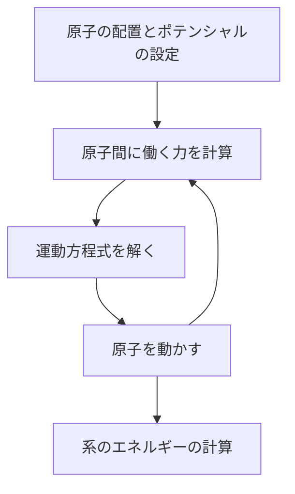

# Molecular Dynamics 理論
&emsp;本ドキュメントでは、LAMMPSやVASPを用いるにあたり、必要となるであろうMDの理論を説明する。

## 目次
1. [概要](#1-概要)
2. [運動方程式](#2-運動方程式)
3. ポテンシャル
4. 系と周期的境界条件
5. 構造最適化
6. 温度制御
7. 圧力制御

## 1. 概要
&emsp;MDとは、Molecular Dynamicsの頭文字をとっており、__分子動力学法__ と訳される。古典力学を用いたシミュレーション方法であり、主に原子間に働く力をポテンシャルから算出し、原子を動かしながら物性を予測するシミュレーションである。昨今では、今まで使われていた経験的ポテンシャルに代わり、機械学習ポテンシャルを用いた計算が主流となってきている。本ドキュメントでは、機械学習ポテンシャルには触れず、MDシミュレーションがどのような流れで行われているかについて述べる。  
　まずは、力学内でのMDの位置づけを見ていく。下の図を見てほしい。  

 

   
この図は有名だが、量子力学や古典力学、連続体力学のシミュレーションの種類と、時間スケール、扱える原子数を示している。MDであれば、1ps~1nsスケールのシミュレーションを扱えるという意味である。 __縦軸は計算コストではないので注意が必要である。__   
　また、研究の観点からの位置づけも見ていく。  

  
このように、実験を行う前に理論に基づいた計算を行うことで、実験コストを最小限に抑えたり、危険性や毒性がある物質の取り扱いが容易となるのである。  
　さて、本編に入る前に、MDシミュレーションの大まかな流れを最後に述べる。  

このフローチャートの中身についてこれから説明していくこととする。

## 2. 運動方程式
　