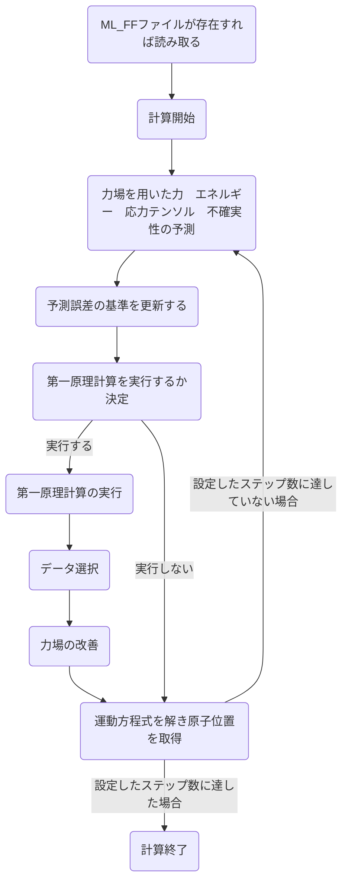

# 機械学習力場の理論
基本的にVASPwikiの[Machine learning force field: Theory](https://www.vasp.at/wiki/index.php/Machine_learning_force_field:_Theory)や[参考文献](#参考文献)にある論文の内容をまとめたものである  

## 1. 全体のアルゴリズム
### フローチャート

### 手順
1. 力場を使用し構造のエネルギー、力、応力テンソルとそれらの[不確実性](#不確実性)を予測する

2. 第一原理計算を実行するか決定する（[アルゴリズム](#on-the-flyで第一原理計算の実行を決定するためのアルゴリズム)）  
実行しない場合はステップ5へ

3. 第一原理計算を実行して[構造データセット](#構造データセット)を得る 得られた構造データセットは参照構造データセットの候補として保存される 

4. 候補として保存された構造データセット数が特定の値に達した場合や、予測された不確実性が大きすぎる場合に[参照構造データセット](#構造データセット)と[局所参照構造](#局所構造)を用いて力場を改善する

5. 原子の位置と速度が更新される 力場が信頼できないと判断された場合（判断基準は不明）は第一原理計算のエネルギー、力、応力テンソルが使用される（[第一原理MD](../VASP_theory/README.md#第一原理MD)） 上記以外の場合は力場によるものが使用される

6. ステップ1へ 所定のステップ数に達したら終了

### 力場の改善/構築条件等
- 力場が存在しない場合  
    - 構造内の全原子が局所参照構造としてサンプリングされ、力場が構築される  

- 力場が存在する場合  
    - いずれかの原子の力のベイズ誤差が厳密な閾値（ML_CDOUB $\times$ ML_CTIFOR）を超えている場合
        - 局所参照構造がサンプリングされ、力場が改善される  
    - いずれかの原子の力のベイズ誤差が閾値（ML_CTIFOR）より大きく、厳密な閾値（ML_CDOUB $\times$ ML_CTIFOR）より小さい場合
        - 構造は学習の候補として追加される
        - 候補として保存出来る数はML_MCONF_NEWで設定されており、追加された候補の数が設定された値に達したら力場を更新する
        - 構造を候補として追加した場合、次に候補として追加するには最低限ML_NMDINTで設定されたステップ分だけ間隔を開ける ただし、厳密な閾値を超えない場合に限る
    - 全ての原子の力のベイズ誤差が厳密な閾値（ML_CDOUB $\times$ ML_CTIFOR）未満の場合
        - 第一原理計算は実行されない

# その他（用語等）
## 不確実性  
σ（smearingのσとは違う）

## On-the-flyで第一原理計算の実行を決定するためのアルゴリズム
予測された不確実性と以前にサンプリングされた履歴に基づく

## 構造データセット  
構造データセットは以下の情報を含む

- ブラベー格子
- 原子位置
- 総エネルギー
- 力
- 応力テンソル

構造データセットの内、力場の改善に用いられるものを参照構造データセットと呼ぶ  

[手順に戻る](#手順)

## 局所構造  
局所構造は以下の情報を含む

- 原子間距離
- 結合角  

これらの局所構造は[記述子](#記述子)に対応付けられる  
局所構造の内、力場の改善に用いられるものを局所参照構造と呼ぶ  

[手順に戻る](#手順)

## 記述子  
&emsp;単一元素系について考える。 $N_a$ 個の原子からなる構造のポテンシャルエネルギー $U$ は局所エネルギー $U_i$ の和で近似される。  

$$ U = \sum_{i=1}^{Na} U_i $$

局所エネルギー $U_i$ は原子 $i$ の周囲の局所環境により決められると考えられる。そこで、局所環境を表すために、原子 $i$ の周囲における原子分布を考える。この分布は、原子 $i$ を中心とした半径 $R_{cut}$ の円について、位置 $r \ (r \leqq R_{cut})$ において原子 $j \ (j \neq i)$ が存在する確率密度 $\rho_i$ で表される。  

$$ \rho_i(\textbf{r}) = \sum_{j=1}^{N_a} f_{cut}(r_{ij})g(\textbf{r}-\textbf{r}_{ij}) $$

ここで、 $f_{cut}$ は半径 $R_{cut}$ より外側の情報を滑らかに除去するカットオフ関数である（詳しくは不明だがsmooth cutoffのことっぽい？）。また、 $r_{ij} = |\textbf{{r}}_{ij}| = |\textbf{r}_j-\textbf{r}_i|$ 、 $g(\textbf{r})$ はデルタ関数 $\delta(\textbf{r})$ である。局所エネルギー $U_i$ を確率密度 $\rho_i$ の関数であるとすると、 $U_i = F[\rho_i(\textbf{r})]$ となる。  
&emsp;これらを数値的に考えるためのもっとも簡単な方法が、確率密度関数を有限個の基底関数の線形結合で表し、係数の関数に変換することである。この時導入するのが記述子であり、記述子は回転や平行移動に対して不変である必要がある。最も単純な記述子は以下で定義される動径分布関数 $\rho_i^{(2)}(r)$ である。

$$ \rho_i^{(2)}(r) = \frac{1}{4\pi}\int\rho_i(r\hat{\textbf{r}})d\hat{\textbf{r}} $$

ここで、 $\hat{\textbf{r}}$ は $r$ の単位ベクトルを表す。しかし、動径分布関数には角度の情報がないため、角度の情報を追加した角度分布関数 $\rho_i^{(3)}(r, s, \theta)$ を導入する。角度分布関数は、原子 $i$ から距離 $r$ の位置において原子 $j$ が存在する確率密度と距離 $s$ の位置において原子 $k$ が存在する確率密度、 $\angle kij$ の角度 $\theta$ を用いて表す。

$$ \rho_i^{(3)}(r, s, \theta) = \int\int\delta(\hat{\textbf{r}}\cdot\hat{\textbf{s}}-cos\theta)\rho_i(r\hat{\textbf{r}})\rho_i^*(s\hat{\textbf{s}})d\hat{\textbf{r}}d\hat{\textbf{s}} $$

 $\rho_i$ が、

$$ \rho_i(\textbf{r}) = \sum_{l=0}^{L_{max}}\sum_{m=-l}^{l}\sum_{n=1}^{N_R^l}c_{nlm}^i\chi_{nl}(r)Y_{lm}(\hat{\textbf{r}}) $$

と表されるとする。ここで、 $c_{nlm}^i$ は係数、 $\chi_{nl}(r)$ は動径基底関数、 $Y_{lm}(\hat{\textbf{r}})$ は球面調和関数である。また、 $n$ ,  $l$ ,  $m$ はそれぞれ主量子数、方位量子数、磁気量子数を表す。 $\chi_{nl}(r)$ には以下のような直交関係がある。  

$$ 4\pi\int_{0}^{\infin}\chi_{nl}(r)\chi_{n'l}(r)r^2dr = \delta(n-n') $$

 $\rho_i(\textbf{r})$ を用いて $\rho_i^{(2)}(r)$ ,  $\rho_i^{(3)}(r, s, \theta)$ , $\rho_i(\textbf{r})$ は以下のように変形される。

$$ \rho_i^{(2)}(r) = \frac{1}{\sqrt{4\pi}}\sum_{n=1}^{N_R^0}c_{n00}^i\chi_{nl}(r) $$

$$ \rho_i^{(3)}(r, s, \theta) = \sum_{l=1}^{L_{max}}\sum_{n=1}^{N_R^l}\sum_{\nu=1}^{N_R^l}\sqrt{\frac{2l+1}{2}} \times P_{n \nu l}^i\chi_{nl}(r)\chi_{\nu l}(s)P_l(cos\theta) $$

$$ P_{n \nu l}^i = \sqrt{\frac{8\pi^2}{2l+1}}\sum_{m=-l}^{l}c_{nlm}^ic_{\nu lm}^{i*} $$

ここで、 $P_l$ は次数 $l$ のルジャンドル多項式である。

[手順に戻る](#手順)

## 参考文献
 1. [Jinnouchi, Ryosuke and Karsai, Ferenc and Kresse, Georg(2019), On-the-fly machine learning force field generation: Application to melting points, Phys. Rev. B, Vol.100,  No. 1, 014105. doi:10.1103/PhysRevB.100.014105](https://link.aps.org/doi/10.1103/PhysRevB.100.014105)  

## メモ  
説明予定  
ポテンシャルエネルギー面（pes）  
力場パラメータの最適化  
不確実性の評価  
不確実性の閾値の設定  
スパース化  
データ選択  

