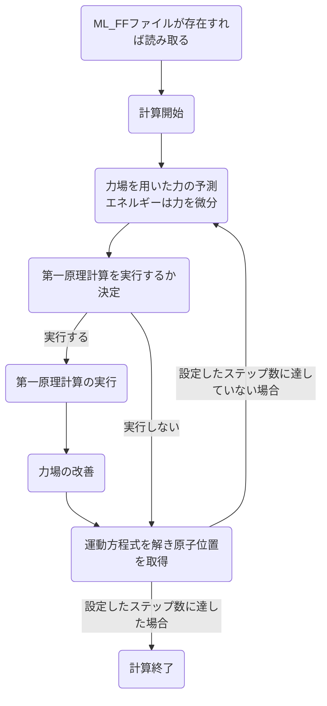

# 機械学習力場の理論
## 1. 全体のアルゴリズム

### フローチャート

### 手順
1. 力場を使用し構造のエネルギー、力、応力テンソルとそれらの[不確実性](#不確実性)を予測する

2. 第一原理計算を実行するか決定する（[アルゴリズム](#on-the-flyで第一原理計算の実行を決定するためのアルゴリズム)）  
実行しない場合はステップ5へ

3. 第一原理計算を実行して[構造データ](#構造データ)を得る  

4. 得られた構造データと[局所構造](#局所構造)を用いて力場を改善する データ数が特定の値に達した場合か、不確実性が大きすぎる場合にのみ力場を改善（学習）する

4. 原子の位置と速度は[第一原理MD](../VASP_theory/README.md#第一原理MD)によって更新される

5. ステップ1へ 所定のステップ数に達したら終了

### 構造の学習

# その他
## 不確実性　&emsp;[手順に戻る](#手順)
σ（smearingのσとは違う）

## On-the-flyで第一原理計算の実行を決定するためのアルゴリズム

## 構造データ  &emsp;[手順に戻る](#手順) 
構造データには以下の情報が含まれる

- ブラベー格子
- 総エネルギー
- 力（各原子に働く力）
- 応力テンソル

## 局所構造  &emsp;[手順に戻る](#手順)  
局所構造には以下の情報が含まれる

- 原子間距離
- 結合角

