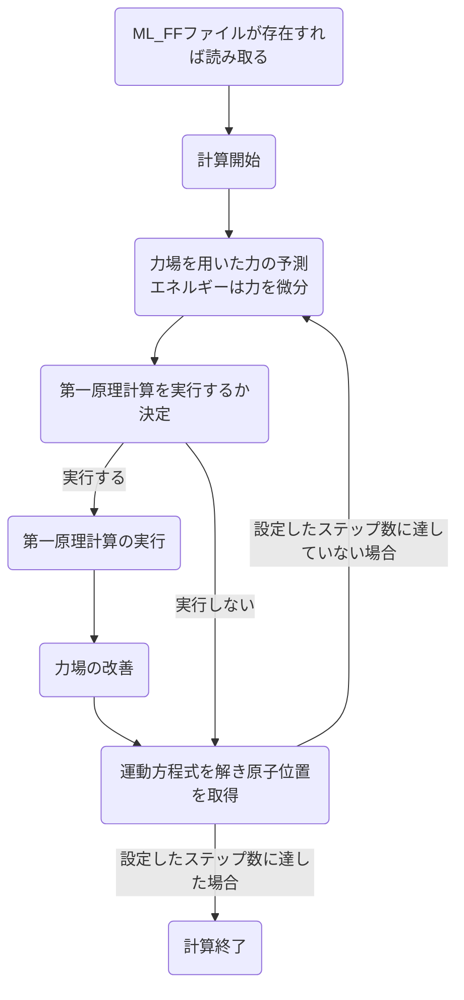

# 機械学習力場の理論
## アルゴリズム

```mermaid
flowchart TB
    A(ML_FFファイルが存在すれば読み取る) --> B(計算開始)
    B --> C(力場を用いた力の予測<br>エネルギーは力を微分)
    C --> D(第一原理計算を実行するか決定)
    D --> |実行する|E(第一原理計算の実行)
    E --> F(力場の改善)
    F --> G(運動方程式を解き原子位置を取得)
    D --> |実行しない|G
    G --> |設定したステップ数に達していない場合|C
    G --> |設定したステップ数に達した場合|H(計算終了)
```

- 各原子に働く力を予測する