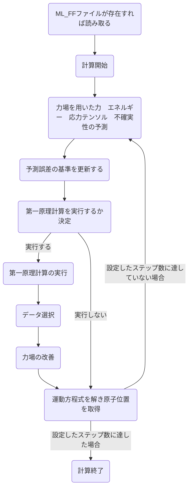

# 機械学習力場の理論
基本的にVASPwikiの[Machine learning force field: Theory](https://www.vasp.at/wiki/index.php/Machine_learning_force_field:_Theory)や[参考文献](#参考文献)にある論文の内容をまとめたものである  

## 1. 全体のアルゴリズム
### フローチャート


### 手順
1. 力場を使用し構造のエネルギー、力、応力テンソルとそれらの[不確実性](#不確実性)を予測する

2. 第一原理計算を実行するか決定する（[アルゴリズム](#on-the-flyで第一原理計算の実行を決定するためのアルゴリズム)）  
実行しない場合はステップ5へ

3. 第一原理計算を実行して[構造データセット](#構造データセット)を得る<br>得られた構造データセットは参照構造データセットの候補として保存される 

4. 候補として保存された構造データセット数が特定の値に達した場合や、予測された不確実性が大きすぎる場合に[参照構造データセット](#構造データセット)と[局所参照構造](#局所構造)を用いて力場を改善する

5. 原子の位置と速度が更新される<br>力場が信頼できないと判断された場合（判断基準は不明）は第一原理計算のエネルギー、力、応力テンソルが使用される（[第一原理MD](../VASP_theory/README.md#第一原理MD)）<br>上記以外の場合は力場によるものが使用される

6. ステップ1へ<br>所定のステップ数に達したら終了

### 力場の改善/構築条件等
- 力場が存在しない場合  
    - 構造内の全原子が局所参照構造としてサンプリングされ、力場が構築される  

- 力場が存在する場合  
    - いずれかの原子の力のベイズ誤差が厳密な閾値（ML_CDOUB $`\times`$ ML_CTIFOR）を超えている場合
        - 局所参照構造がサンプリングされ、力場が改善される  
    - いずれかの原子の力のベイズ誤差が閾値（ML_CTIFOR）より大きく、厳密な閾値（ML_CDOUB $`\times`$ ML_CTIFOR）より小さい場合
        - 構造は学習の候補として追加される
        - 候補として保存出来る数はML_MCONF_NEWで設定されており、追加された候補の数が設定された値に達したら力場を更新する
        - 構造を候補として追加した場合、次に候補として追加するには最低限ML_NMDINTで設定されたステップ分だけ間隔を開ける<br>ただし、厳密な閾値を超えない場合に限る
    - 全ての原子の力のベイズ誤差が厳密な閾値（ML_CDOUB $`\times`$ ML_CTIFOR）未満の場合
        - 第一原理計算は実行されない


# その他（用語等）
## 構造データセット  
構造データセットは以下の情報を含む

- ブラベー格子
- 原子位置
- 総エネルギー
- 力
- 応力テンソル

構造データセットの内、力場の改善に用いられるものを参照構造データセットと呼ぶ  

[<sub>手順に戻る</sub>](#手順)

## 局所構造  
局所構造は以下の情報を含む

- 原子間距離
- 結合角  

これらの局所構造は[記述子](#記述子)に対応付けられる  
局所構造の内、力場の改善に用いられるものを局所参照構造と呼ぶ  

[<sub>手順に戻る</sub>](#手順)

## 記述子    
記述子：分子等の特徴を数値的に表現するもの

&emsp;$`N_a`$ 個の原子からなる構造のポテンシャルエネルギー $`U`$ を局所エネルギー $`U_i`$ の和で近似する。  
```math
U = \sum_{i=1}^{Na} U_i
```
局所エネルギー $`U_i`$ は原子 $`i`$ の周囲の局所環境により決められると考える。局所環境を表すために原子 $`i`$ の周囲における原子分布を考える。この分布は、原子 $`i`$ を中心とした半径 $`R_{cut}`$ の円について、位置 $`r \ (r \leqq R_{cut})`$ において原子 $`j \ (j \neq i)`$ が存在する確率密度 $`\rho_i`$ で表される。  
```math
\rho_i(\textbf{r}) = \sum_{j=1}^{N_a} f_{cut}(r_{ij})g(\textbf{r}-\textbf{r}_{ij})
```
ここで、 $`f_{cut}`$ は半径 $`R_{cut}`$ より外側の情報を除去するカットオフ関数らしい（詳しくは不明だがsmooth cutoffのことっぽい？）。また、 $`r_{ij} = |\textbf{{r}}_{ij}| = |\textbf{r}_j-\textbf{r}_i|`$ 、 $`g(\textbf{r})`$ はデルタ関数 $`\delta(\textbf{r})`$ である。局所エネルギー $`U_i`$ を確率密度 $`\rho_i`$ の関数であるとすると、 $`U_i = F[\rho_i(\textbf{r})]`$ となる。  
&emsp;これらを数値的に考える方法は、確率密度関数を有限個の基底関数の線形結合で表し、係数の関数に変換する方法である。この時導入するのが記述子であり、記述子は回転や平行移動に対して不変である必要がある。導入する記述子は以下で定義される動径分布関数 $`\rho_i^{(2)}(r)`$ である。
```math
\rho_i^{(2)}(r) = \frac{1}{4\pi}\int\rho_i(r\hat{\textbf{r}})d\hat{\textbf{r}}
```
ここで、 $`\hat{\textbf{r}}`$ は $r$ の単位ベクトルを表す。しかし、動径分布関数には角度の情報がないため、角度の情報を追加した角度分布関数 $`\rho_i^{(3)}(r, s, \theta)`$ を導入する。角度分布関数は、原子 $`i`$ から距離 $`r`$ の位置において原子 $`j`$ が存在する確率密度、距離 $`s`$ の位置において原子 $`k`$ が存在する確率密度、 $`\angle kij`$ の角度 $`\theta`$ を用いて表す。
```math
\rho_i^{(3)}(r, s, \theta) = \int\int\delta(\hat{\textbf{r}}\cdot\hat{\textbf{s}}-cos\theta)\rho_i(r\hat{\textbf{r}})\rho_i^*(s\hat{\textbf{s}})d\hat{\textbf{r}}d\hat{\textbf{s}}
```
$`\rho_i`$ が、
```math
\rho_i(\textbf{r}) = \sum_{l=0}^{L_{max}}\sum_{m=-l}^{l}\sum_{n=1}^{N_R^l}c_{nlm}^i\chi_{nl}(r)Y_{lm}(\hat{\textbf{r}})
```
と表されるとする。ここで、 $`c_{nlm}^i`$ は係数、 $`\chi_{nl}(r)`$ は動径基底関数、 $`Y_{lm}(\hat{\textbf{r}})`$ は球面調和関数である。また、 $`n`$ ,  $`l`$ ,  $`m`$ はそれぞれ主量子数、方位量子数、磁気量子数を表す。 $`\chi_{nl}(r)`$ には以下のような直交関係がある。  
```math
4\pi\int_{0}^{\infty}\chi_{nl}(r)\chi_{n'l}(r)r^2dr = \delta(n-n')
```
$`\rho_i(\textbf{r})`$ を用いて $`\rho_i^{(2)}(r)`$ ,  $`\rho_i^{(3)}(r, s, \theta)`$ は以下のように変形される。
```math
\rho_i^{(2)}(r) = \frac{1}{\sqrt{4\pi}}\sum_{n=1}^{N_R^0}c_{n00}^i\chi_{nl}(r)
```
```math
\rho_i^{(3)}(r, s, \theta) = \sum_{l=1}^{L_{max}}\sum_{n=1}^{N_R^l}\sum_{\nu=1}^{N_R^l}\sqrt{\frac{2l+1}{2}} \times P_{n \nu l}^i\chi_{nl}(r)\chi_{\nu l}(s)P_l(cos\theta)
```
```math
P_{n \nu l}^i = \sqrt{\frac{8\pi^2}{2l+1}}\sum_{m=-l}^{l}c_{nlm}^ic_{\nu lm}^{i*}
```
ここで、 $`P_l`$ は次数 $`l`$ の[ルジャンドル多項式](#ルジャンドル多項式)である。  

&emsp;MLFFではポテンシャルエネルギー面 $`U`$ を上記の $`\rho_i^{(2)}(r)`$ ,  $`\rho_i^{(3)}(r, s, \theta)`$ によりパラメータ化するため、 $`U_i`$ は $`\rho_i^{(2)}(r)`$ , $`\rho_i^{(3)}(r, s, \theta)`$ の関数となる。  
```math
U_i = F[\rho_i^{(2)}(r), \rho_i^{(3)}(r, s, \theta)]
```
続いて、 $`N_B`$ 個局所構造を局所参照構造とし、局所参照構造を記述子空間の係数  $`X_{i_B}`$ （[記述子行列 / 計画行列](#記述子行列)？）に変換する（局所参照構造のパラメータを行列で表すってことなのか？）。
```math
F[\rho_i^{(2)}(r), \rho_i^{(3)}(r, s, \theta)] = \sum_{i_B=1}^{N_B}w_{i_B}K(\textbf{X}_i, \textbf{X}_{i_B})
```
ここで、 $`\textbf{X}_i`$ は係数 $`c_{n00}^i`$ , $`P_{n \nu l}^i`$ を含むベクトル、 $`w_{i_B}`$ は係数である。また、関数 $`K`$ は対象の局所構造と局所参照構造の類似性を測る関数（カーネルのこと）であり、二つの構造が似ていれば1に近づき、似ていなければ小さな値となる。関数 $`K`$ は以下のように表される。
```math
K(\textbf{X}_i, \textbf{X}_{i_B}) = \beta^{(2)}(\textbf{X}_i^{(2)}\cdot\textbf{X}_{i_B}^{(2)})+\beta^{(3)}(\hat{\textbf{X}}_i^{(3)}\cdot\hat{\textbf{X}}_{i_B}^{(3)})^{\zeta^{(3)}}
```
ここで、 $`\textbf{X}_i^{(2)}`$ , $`\textbf{X}_i^{(3)}`$ はそれぞれ $`c_{n00}^i`$ , $`P_{n \nu l}^i`$ を含むベクトルである。また、$`\hat{\textbf{X}}_i^{(3)}`$ は $`\textbf{X}_i^{(3)}`$ を正規化したベクトルである。加えて、 $`\beta^{(2)}`$ , $`\beta^{(3)}`$ は重み、 $`\zeta^{(3)}`$ は関数 $`K`$ の鋭さを表す。 $`K(\textbf{X}_i, \textbf{X}_{i_B})`$ の最初の項は二体相互作用、二項目は多体相互作用を表しており、多体相互作用の方はSOAPとして知られており以下のように表すことが出来る。
```math
(\textbf{X}_i^{(3)}\cdot\textbf{X}_{i_B}^{(3)}) = \int|S_{ii_B}(\hat{R})|^2d\hat{R}
```
```math
S_{ii_B}(\hat{R}) = \int\rho_i(\textbf{r})\rho_{i_B}(\hat{R}\textbf{r})d\textbf{r}
```
また、同様に最初の項についても以下のように表すことが出来る。
```math
\textbf{X}_i^{(2)}\cdot\textbf{X}_{i_B}^{(2)} = 4\pi\int_{0}^{R_{cut}}\rho_i^{(2)}(r)\rho_{i_B}^{(2)}(r)r^2dr
```

[<sub>手順に戻る</sub>](#手順)

## ルジャンドル多項式
$`n`$次のルジャンドル多項式の定義
```math
P_n(x) = \frac{(-1)^n}{2^nn!}\frac{d^n}{dx^n}(1-x^2)^n
```
```math
n = 0, 1, 2, \cdots
```

## 記述子行列  
記述子行列は計画行列らしい  
https://hyogo-bl.jp/docs/pdf/status-report/2020.08.26MI_Fujii.pdf  

## エネルギー、力、応力テンソル、不確実性の予測
パラメータ $`w_{iB}`$ を求めるために、 $`N_{st}`$ 個の参照構造データセットのエネルギー、力、応力テンソルを知る必要がある。原子一つ当たりの総エネルギーは以下の式で表される。
```math
\frac{U^\alpha}{N_a^\alpha} = \sum_{i=1}^{N_a^\alpha}\frac{U_i^\alpha}{N_a^\alpha} = \sum_{i_B=1}^{N_B}w_{i_B}\sum_{i=1}^{N_a^\alpha}\frac{K(\textbf{X}_i^\alpha, \textbf{X}_{i_B})}{N_a^\alpha}
```
```math
\forall\alpha = 1, \cdots, N_{st}
```
ここで、上付き文字の $`\alpha`$ は「構造 $`\alpha`$ の」という意味である。また、 $`U^\alpha`$ は第一原理計算によるエネルギーである。また、論文において「原子ごとの第一原理計算エネルギー（FP eenrgy per atom）」と記述されていたが、第一原理計算によるエネルギーを原子数で割った $`\frac{U^\alpha}{N_a^\alpha}`$ のことを指すと解釈した。上記の関係を以下のように行列で表すことが出来る。
```math
\textbf{y}^\alpha = \boldsymbol{\phi}^\alpha\textbf{w}
```
```math
\forall\alpha = 1, \cdots, N_{st}
```
ここで、 $`\textbf{y}^\alpha`$ は $`m^\alpha`$次元列ベクトルである。具体的には、原子ごとの第一原理計算によるエネルギー（the dimensionless FP potential energy per atom）、力（各原子の力、3成分）、応力テンソル（[対称性を考えると6成分になる](https://physics-school.com/stress-tensor/)）が含まれている。
```math
m^\alpha = 1+3N_a^\alpha+6
```
原子ごとの第一原理計算によるエネルギー、力、応力テンソルはそれぞれ参照構造データセットの原子ごとの第一原理計算によるエネルギー、力、応力テンソルの標準偏差で割ることで無次元化されている。また、 $`\textbf{w}`$ は $`N_B`$ 次元列ベクトルであり、係数 $`w_{i_B}`$ から構成される。 $`\boldsymbol{\phi}^\alpha`$ は $`m^\alpha \times N_B`$ 行列であり、1行目は $`\sum\nolimits_{i=1}^{N_a^\alpha}\frac{K(\textbf{X}_i^\alpha, \textbf{X}_{i_B})}{N_a^\alpha}`$ 、2行目以降は構造 $`\alpha`$ の原子座標に関するエネルギーの導関数（？）等から成る（原文はfirst line, second lineと表記されており、列ベクトルに対してもfirst line, second lineと記述されていたので行と訳した）。  

&emsp;記述子 $`\textbf{x}_i`$ を持つ新しい構造のエネルギー、力を得るために以下の式を用いることが出来る。
```math
\textbf{y} = \boldsymbol{\phi}\textbf{w}
```
ここで、 $`\boldsymbol{\phi}`$ の1行目は $`K(\textbf{X}_i, \textbf{X}_{i_B})`$ 、以降の行は構造内の座標に関する関数 $`K`$ の偏導関数で構成される（？）。  

&emsp;従来の方法は事前に第一原理計算を様々な構造に対して実行し、その中から局所構造を選択しパラメータ $`w`$ を最適化する。しかし、MLFFではMDシミュレーションを実行しながら、第一原理計算の実行、選択、パラメータの最適化を行う。これには不確実性の評価が必要であり、第一原理計算を実行するかどうかを決定するために用いられる。パラメータの最適化と不確実性の予測は[ベイズ線形回帰](#ベイズ線形回帰)が用いられる。  
&emsp;有限のカットオフ半径を用いることでカットオフ半径外の原子の影響が無視されるため、第一原理計算には小さな誤差が含まれる。このような誤差をガウス分布を持つノイズによりモデル化出来ると仮定する。事後確率 $`p(\textbf{w}|\textbf{Y})`$ は以下のようなガウス分布として表される。
```math
p(\textbf{w}|\textbf{Y}) = \mathcal{N}(\bar{\textbf{w}}, \boldsymbol{\Sigma})
```
```math
\bar{\textbf{w}} = \frac{1}{\sigma_v^2}\boldsymbol{\Sigma\Phi}^T\textbf{Y}
```
```math
\boldsymbol{\Sigma}^{-1} = \frac{1}{\sigma_w^2}\textbf{I}+\frac{1}{\sigma_v^2}\boldsymbol{\Phi}^T\boldsymbol{\Phi}
```
ここで、 $`\textbf{Y}`$ は参照構造データセットにおける全ての第一原理計算によるエネルギー、力、応力テンソルを含んでいる、大きさ $`M = \sum\nolimits_{\alpha=1}^{N_{st}}m^\alpha`$ のスーパーベクトル（高次元ベクトル）と呼ばれる。また、 $`\boldsymbol{\Phi}`$ は全ての参照構造データセットにおける行列 $`\boldsymbol{\phi}^\alpha`$ の集合となる $`M \times N_B`$ の計画行列、 $`\textbf{I}`$ は単位行列である。加えて、 $`\sigma_v^2`$ , $`\sigma_w^2`$ は力場の精度と堅牢性のバランスを取るために最適化されたパラメータを表す）。さらに、 $`\mathcal{N}(\bar{\textbf{w}}, \boldsymbol{\Sigma})`$ は $`\bar{\textbf{w}}`$ を中心とする多次元正規化ガウス関数（multidimensional normalized Gaussian）であり、以下に定義される。
```math
\mathcal{N}(\bar{\textbf{w}}, \boldsymbol{\Sigma}) = \frac{1}{\sqrt{(2\pi)^{N_B}\|\boldsymbol{\Sigma}\|}} \times \exp \left[-\frac{(\textbf{w}-\bar{\textbf{w}})^T\boldsymbol{\Sigma}^{-1}(\textbf{w}-\bar{\textbf{w}})}{2}\right]
```
ここで、 $`\|\boldsymbol{\Sigma}\|`$ は行列 $`\boldsymbol{\Sigma}`$ の行列式である。最適化された係数はガウス分布の中心である $`\textbf{w}=\bar{\textbf{w}}`$ において決定される（ $`\bar{\textbf{w}}`$ はリッジ回帰により得られたベクトルに等しくなるらしい）。***不確実性の予測は $`\textbf{y}`$ における正確なエネルギー、力、応力テンソルを見つける確率により与えられる***。この事後分布 $`p(\textbf{y}|\textbf{Y})`$ は以下のように与えられる。
```math
p(\textbf{y}|\textbf{Y}) = \mathcal{N}(\boldsymbol{\phi}\bar{\textbf{w}}, \boldsymbol{\sigma})
```
```math
\boldsymbol{\sigma} = \sigma_v^2\textbf{I}+\boldsymbol{\phi}^T\boldsymbol{\Sigma}\boldsymbol{\phi}
```
ここで、ベクトル $`\boldsymbol{\phi}\bar{\textbf{w}}`$ は無次元のエネルギー、力、応力テンソルを含む。また、共分散行列 $`\boldsymbol{\sigma}`$ は各無次元成分の分散を与える。共分散行列の2項目は回帰係数 $`\textbf{w}`$ における不確実性に対応しており、学習データが必要かどうかの判断が可能である。リッジ回帰と同様に過学習を防ぐためには $`\sigma_v^2`$ , $`\sigma_w^2`$ の最適化が必要であり、最適化はエビデンス近似（evidence approximation）により行われる。これらのパラメータは以下のようなエビデンス関数と呼ばれる、周辺尤度（ゆうど）関数 $`p(\textbf{Y}|\sigma_v^2, \sigma_w^2)`$ を最大化することで決められる。
```math
p(\textbf{Y}|\sigma_v^2, \sigma_w^2) = \left(\frac{1}{\sqrt{2\pi\sigma_v^2}}\right)^M\left(\frac{1}{\sqrt{2\pi\sigma_w^2}}\right)^{N_B} \times \int\exp[-E(\textbf{w})]d\textbf{w}
```
```math
E(\textbf{w}) = \frac{1}{2\sigma_v^2}\|\boldsymbol{\Phi}\textbf{w}-\textbf{Y}\|^2+\frac{1}{2\sigma_w^2}\|\textbf{w}\|^2
```
GAPとの相違点
GAP：カーネルリッジ回帰
MLFF：ベイズ線形回帰

## ベイズ線形回帰

## リッジ回帰  
重回帰分析の損失関数に正則化項を加えたのもがリッジ回帰になる
https://qiita.com/Takayoshi_Makabe/items/8f6dcb25124b9dcb1ae8


## On-the-flyで第一原理計算の実行を決定するためのアルゴリズム
予測された不確実性と以前にサンプリングされた履歴に基づく  

## 参考文献
 1. [Jinnouchi, Ryosuke and Karsai, Ferenc and Kresse, Georg(2019), On-the-fly machine learning force field generation: Application to melting points, Phys. Rev. B, Vol.100,  No. 1, 014105. doi:10.1103/PhysRevB.100.014105](https://link.aps.org/doi/10.1103/PhysRevB.100.014105)  

2. [ルジャンドル多項式の性質（証明付き）, 理数アラカルト, 2022.](https://risalc.info/src/Legendre-polynomial.html)

3. [応力テンソルの導入, 物理の学校, 2019.](https://physics-school.com/stress-tensor/)

## メモ  
説明予定  
ポテンシャルエネルギー面（pes）  
力場パラメータの最適化  
不確実性の評価  
不確実性の閾値の設定  
スパース化  
データ選択  
